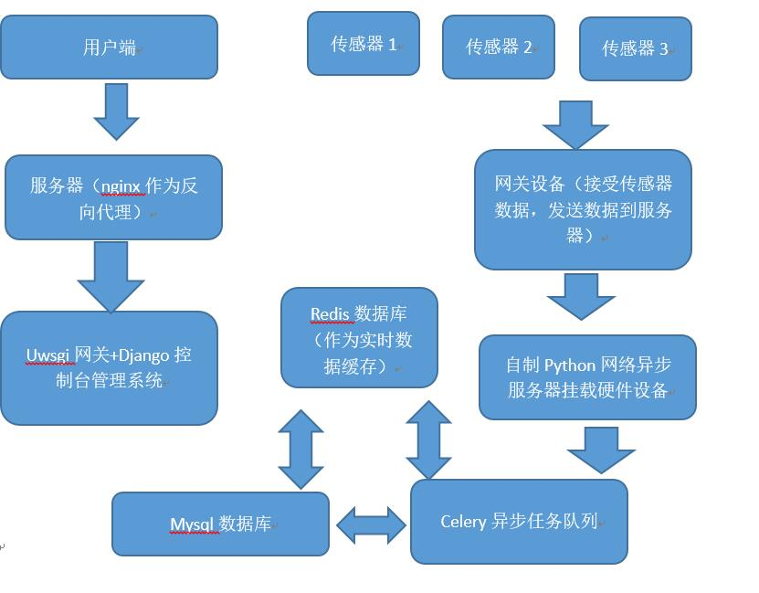

### [文档地址](http://outshineamaze.github.io/iotshine/)
### 功能简介：
硬件接入功能
1.	  数字型传感器接入
2.	  坐标新设备接入
3.	  图像设备接入
4.	视频设备接入
5.	布尔型设备接入
6.	自定义设备接入（最后实现测试使用）
<!-- more -->

控制台中心功能
1. 用户注册（重写用户注册登陆模块）
2. 用户添加删除硬件设备
3. 用户管理数据节点（手动添加删除等）

    
### 技术框架简介：

#### 第一层：
用户端：用户端主要为网页平台和微信平台（待认证），同时也开发了api接口用于以后的app开发接入。

#### 第二层：
 网关代理： 在控制台系统中使用nginx作为反向代理挂载django程序。 在硬件设备上，使用树莓派之类具有socket 编程发送数据的单片机设备作为硬件设备的网关，将收取的数据通过http协议发送到tornado异步服务器，

#### 第三层：
Django控制台就是直接和用户打交道的，用户与系统和硬件设备的控制交互全部基于django的物联网设备控制台前端管理系统。 
Tornado在系统主要负责处理硬件上传的数据，由于其本身是异步的服务器，所以相等的硬件下可以同时挂载更多多的设备，在系统的有着相当重要的地位。

#### 第四层：
底层使用的是mysql数据库，同时与mysql同时搭配的redis内存数据库一起使用，其中mysql实现数据的持久化储存，redis实现临时数据的缓存，主要使用的场合就是实时监控或者控制数据储存。

