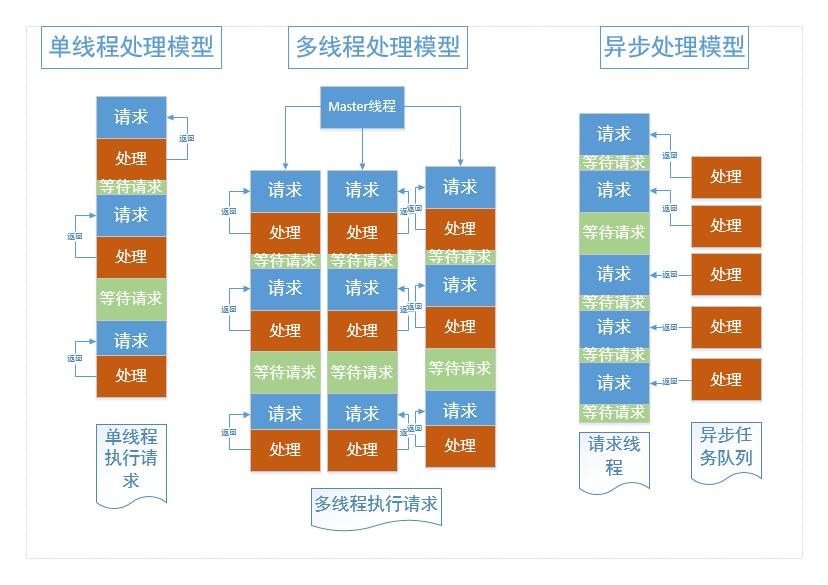

这一篇文章来说说celery的分布式任务队列
首先,要明白这几个问题 
1.   为什么要分布式任务队列?
2.   为什么使用celery这个分布式任务队列?
3.   如何在项目中使用celery来执行异步任务队列?
<!-- more -->
#### 回答第一个问题:为什么使用分布式任务队列
Celery 是一个简单、灵活且可靠的，处理大量消息的分布式系统，并且提供维护这样一个系统的必需工具。
这个和我们的任务需求很相似,我们的服务器需要有哪些性能的需求呢?首先就是要可以承受高负载,这个我们前面使用高性能的nginx做负载均衡和静态文件处理,所以这方面我们不用太担心.至于我们自己写的httpserver那块
,使用了epoll这种高效的io复用模型,也可以很轻松的解决高并发的带来的问题. 那么现在影响我们服务器性能的关键就是我们的框架业务处理部分,这部分的代码会涉及到数据库的操作还有普通的磁盘io操作,所以这里我们就可以异步的任务队列,我们把每个业务扔给任务队列,这个队列然后异步的处理队列里面的每个任务,这样不会阻塞我们的主线程,下面的图可以简单的解释一下为什么要使用分布式任务队列

#### 其他的两个问题见下文

话不多说,马上来体验一下celery异步任务队列的魅力吧
### 编写应用程序
使用@app.task修饰函数就可以了

   $ pip install -U Celery
```python
from celery import Celery
import time
app = Celery('tasks',backend='redis://127.0.0.1:6379' ,broker='redis://127.0.0.1:6379')

@app.task
def add(x, y):
	print 'success add %d%d=%d'%(x,y,x+y)
	time.sleep(5)
	return x + y
```

### 运行 Celery 任务服务器
celery -A tasks worker 
来执行我的celery服务器
在生产环境中你会想要让celery程序作为守护程序在后台运行。你需要用你所在平台提供的工具来实现，或是像 supervisord 这样的东西

### 调用我们任务,
```
from tasks import add
add.delay(4, 4)
```
这是最简单的调用方式了 .

### 保存结果

下例中你将会使用 redis结果后端来发送状态消息。后端通过 Celery 的 backend 参数来指定。如果你选择使用配置模块，则通过 CELERY_RESULT_BACKEND 选项来设置:
 （常见的搭配）:
 ```
     app = Celery('tasks',backend='redis://127.0.0.1:6379'         ,broker='redis://127.0.0.1:6379')
```
配置好结果后端后，让我们再次调用任务。这次你会得到调用任务后返回的 AsyncResult 实例:

      result = add.delay(4, 4)
ready() 方法查看任务是否完成处理:

     result.ready()

你可以等待任务完成，但这很少使用，因为它把异步调用变成了同步调用:

    result.get(timeout=1)

倘若任务抛出了一个异常， get() 会重新抛出异常， 但你可以指定 propagate 参数来覆盖这一行为:

     result.get(propagate=False)
如果任务抛出了一个异常，你也可以获取原始的回溯信息:

     result.traceback

以上是参考celery的官方文档的:详情见  [官方文档](http://docs.jinkan.org/docs/celery/getting-started/first-steps-with-celery.htmlresult)


上面是对celery的简单介绍,具体在项目的应用等demo应用发布了就可以直接看源代码了.
开发到这里说实话硬件负载服务器的框架的整体已经搭建差不多了,接下里的是继续完善该框架的各种功能和提高框架的性能和稳定性.


如果看了第一篇文章应该知道,我们整个系统是由两部分组成的

*   是硬件负载服务器
*   是用户控制台.

前面的这么几篇文章都是关于第一部分硬件负载服务器的,后面在开发服务器程序的同时也要开发用户控制台了

关于用户控制台,我会使用PHP或者django来开发,至于为什么要把这个系统分为两个分割的平台是有原因的

*     一方面是提高了系统的容错性

*     另外一方面硬件服务器可能需要实现各种自定义的协议,直接用其他的异步框架(如tornado)会极大限制了灵活性.
*    把用户控制台分离便于不断的迭代更新,一个系统变得庞大时就得考虑模块分离了,而我们的iotshine一开始就将这两大模块分离出来.虽然配置起来可能不是很方便,可是谁叫人生在于折腾呢
